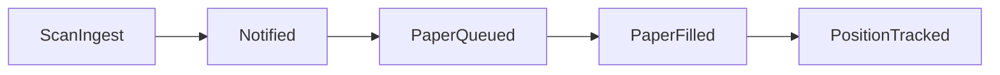

> **Last updated**: 2026-03-12

# Active Buy App MVP

## Goal

定義新 app repo 的最小可行形狀，讓它能：

1. ingest 這個 repo 輸出的 weekly scan artifacts
2. 管理 watchlists
3. 發送通知
4. 在下一階段自然延伸到 paper execution
5. 以明確 gate 控制 broker automation

## Repo Responsibility

新 app repo 應專注在產品層：

- watchlist management
- signal intake / dedup
- notification delivery
- paper execution state
- broker integration

不應負責：

- 訊號研究
- 指標公式調整
- 回測方法學
- research ranking 邏輯本身

這些仍應留在 `quant-binance-spot`。

## Phase 1 MVP

### Required Inputs

新 app repo 直接讀取：

- `reports/active_buy_scan/latest_scan.json`
- `reports/active_buy_scan/latest_digest.md`

### Required Features

- ingest latest scan artifact
- deduplicate by `symbol + signal_family + executable_timestamp`
- manage a user-curated watchlist
- send notification if:
  - `signal_status = buy`
  - `notify_eligible = true`
- store notification history

### Suggested Repo Shape

```text
active-buy-app/
├── app/
│   ├── ingest/
│   ├── watchlists/
│   ├── notifications/
│   ├── state/
│   └── main.py
├── config/
│   ├── app.yaml
│   └── watchlists.yaml
├── data/
│   ├── inbox/
│   └── app_state/
├── tests/
└── README.md
```

## Phase 1 Core Data Models

### Watchlist Entry

每個標的至少有：

- `symbol`
- `enabled`
- `user_priority`
- `max_stage`
  - `notify_only`
  - `paper_ok`
  - `broker_ok`

### Signal Intake Record

從 research repo ingest 後應儲存：

- `symbol`
- `signal_family`
- `signal_timestamp`
- `executable_timestamp`
- `research_priority_score`
- `watchlist_tier`
- `execution_stage_recommendation`
- `research_tag`
- `raw_payload_hash`

### Notification History

每次發送通知要記錄：

- `notification_id`
- `symbol`
- `signal_key`
- `sent_at`
- `channel`
- `status`

## Phase 2: Paper Execution

只有在通知流程穩定後，才加這一層。

### New State

- `portfolio_cash`
- `positions`
- `paper_orders`
- `paper_fills`
- `signal_to_order_map`

### Required Behavior

- 同一 signal 不重複建立 paper order
- 只有 `paper_trade_eligible = true` 才能進 paper queue
- 若 app repo 的 watchlist 規則更嚴，使用 app repo 規則

### State Transition



## Phase 3: Broker Automation Gate

這一層必須晚於 paper execution。

### Hard Gate

除非以下條件都成立，否則不得自動下單：

1. `broker_auto_eligible = true`
2. watchlist entry 的 `max_stage = broker_ok`
3. app repo 風控規則允許
4. broker adapter 健康狀態正常
5. 相同 signal 尚未送出 live order

### Default Recommendation

一開始所有標的都應視為：

- `broker_auto_eligible = false`

即使 research repo 給的是 `paper_candidate`，也不代表直接可以 live auto-buy。

## Execution Stages

app repo 應尊重來自 research repo 的 `execution_stage_recommendation`：

- `no_action`
- `manual_notify`
- `paper_candidate`
- `broker_auto_candidate`
- `blocked`

但 app repo 仍可更保守，不可更激進。

## Recommended Build Order

1. ingest + history
2. Telegram notification sender
3. watchlist config and per-symbol enable/disable
4. signal dedup
5. paper state
6. broker adapter

## Success Criteria

### Phase 1

- 每週 digest 可穩定 ingest
- 不會重複通知同一 signal
- watchlist tier / research priority 能正確反映到通知

### Phase 2

- 同一 signal 不會重複產生 paper order
- paper portfolio state 可回放
- 每次 paper execution 都能追溯到對應 signal

### Phase 3

- 只有 `core` 標的逐步開放到 broker stage
- 可支援 approval / rollback / idempotency

