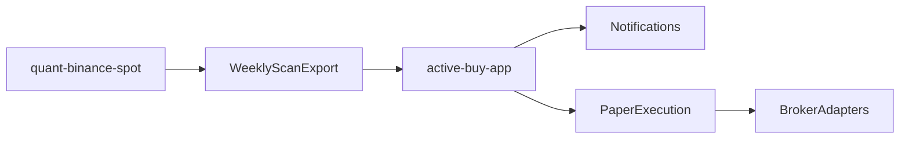

> **Last updated**: 2026-03-12

# Active Buy Architecture

## Goal

為「優質標的主動買入系統」定義清楚的 repo 邊界、訊號輸出契約、與產品落地順序。

本文件的核心決策是：

- `quant-binance-spot` 保留為 **research / signal-definition core**
- watchlist、通知、paper execution、券商 API 自動下單，放在 **另一個 app repo**

## Boundary Decision

採用 `shared_core_separate_app`。

## Why This Split

目前這個 repo 已經是：

- futures-first 的研究 / 回測 / 驗證 / live-trading 系統
- 有完整的 anti-bias guardrails
- 有 production candidate、風控、validation、orchestration 治理流程

如果把「長期投資主動買入產品」直接塞進同一個 operational surface，會混淆：

- research vs end-user execution
- crypto futures live stack vs cross-asset long-only investing workflow
- stateless signal generation vs user/account/portfolio state
- quant governance vs broker/order lifecycle

因此建議拆成：

- **這個 repo**：負責定義與輸出訊號
- **新 app repo**：負責把訊號變成通知、paper order、與未來的 broker order

## Ownership Split

### This Repo Keeps

- signal research and iteration
- universe research and scoring logic
- causal signal definitions
- backtest / validation methodology
- exportable scan outputs
- research tags such as `suitable` / `experimental` / `avoid`
- Telegram-ready digest outputs

### New App Repo Owns

- watchlists and user-selected "quality asset" universes
- scheduling and polling
- notification delivery
- paper trading state
- broker adapters and order placement
- account, cash, and position state
- idempotency, audit log, retry behavior

## Key Design Rule

**不要讓 broker/account state 回流到這個 repo。**

這個 repo 應該回答：

- 什麼時候是買點？
- 這個訊號強不強？
- 什麼時候可執行？
- 研究上建議 `suitable` / `experimental` / `avoid` 哪一類？

新 app repo 應該回答：

- 這個使用者要不要採用？
- 要買多少？
- 是否已經通知 / 下單過？
- 目前帳戶與持倉狀態是什麼？

## Delivery Phases

### Phase 1: Alerts First

目標：快速交付有用產品。

- research repo 產出 weekly scan
- app repo 讀取 scan 並發通知
- 下單完全人工

### Phase 2: Paper Execution

目標：驗證流程，不先碰真實券商風險。

- app repo 維護 paper portfolio state
- 把已核准的 signal 轉成 paper order
- 追蹤 cash / fills / position history

### Phase 3: Broker Automation

目標：在有足夠把握後，讓部分標的可自動買入。

- broker adapter layer
- per-broker symbol mapping / lot size / order constraints
- approval and risk rails before live execution

## Initial Repo Surface

這個 repo 的第一個 implementation milestone 應包含：

1. 一份 architecture / contract doc
2. 一支 weekly scan / export script
3. 一份 scan config
4. 僅輸出 signal contract 與通知導向 artifact，不處理 order execution

目前實作路徑：

- Architecture doc: `docs/ACTIVE_BUY_ARCHITECTURE.md`
- App repo MVP doc: `docs/ACTIVE_BUY_APP_MVP.md`
- Scan config: `config/research_active_buy_scan.yaml`
- Scan script: `scripts/scan_active_buy_candidates.py`
- Output directory: `reports/active_buy_scan/`

## Signal Contract

### Signal Family

目前 contract 以這條研究中的 active-buy 訊號為主：

- `signal_family = pine_weekly_histogram_reversal`
- 來源：faithful TradingView replication
- 主邏輯：
  - `RSI[1] < 30`
  - `hist[2] > hist[1] and hist[1] < hist`
- 執行時點：
  - signal on completed weekly bar
  - executable at **next weekly open**

### Output Schema

每次 weekly scan 對每個 symbol 輸出一列 / 一個 object。

| Field | Meaning |
|------|---------|
| `contract_version` | 目前輸出契約版本 |
| `scan_run_at` | scan 執行時間（UTC ISO timestamp） |
| `symbol` | 資產代號 |
| `group` | universe group |
| `asset_class` | 資產類別 |
| `data_source` | 數據來源，例如 `parquet` |
| `signal_family` | 訊號家族名稱 |
| `signal_status` | `buy` 或 `no_action` |
| `signal_timestamp` | 已完成週線 bar 的時間戳 |
| `executable_timestamp` | 可執行時間，預設為下一個週開盤 |
| `latest_data_timestamp` | 本地數據最新時間戳 |
| `latest_completed_week` | 本次判斷使用的已完成週線時間戳 |
| `rsi_prev` | `RSI[1]` 數值 |
| `hist_prev2` | `hist[2]` 數值 |
| `hist_prev1` | `hist[1]` 數值 |
| `hist_now` | `hist` 當前值 |
| `hist_turn` | 是否符合 histogram reversal |
| `atr_branch_active` | ATR add-on branch 是否同時成立 |
| `research_priority_score` | 研究層訊號強度分數 |
| `research_rank` | 本次 scan 的研究排序 |
| `priority_score` | 0-100 ranking score |
| `rank` | active buy candidates 之間的排序 |
| `research_tag` | `suitable` / `experimental` / `avoid` |
| `watchlist_tier` | 人工維護的 watchlist 層級，例如 `core` / `satellite` / `experimental` / `avoid` |
| `watchlist_priority_label` | 給通知與 app repo 顯示的人類可讀 priority label |
| `execution_stage_recommendation` | 對 app repo 的預設執行階段建議，例如 `manual_notify` / `paper_candidate` |
| `notify_eligible` | 是否適合進通知流程 |
| `paper_trade_eligible` | 是否適合進 paper execution |
| `broker_auto_eligible` | 是否達到 research 層允許自動下單的條件（預設應保守為 `false`） |
| `message_notes` | 供通知文案使用的備註 |
| `telegram_digest_line` | 每檔可直接嵌入週報摘要的單行文案 |

### Transport

先從最簡單的方式開始：

- `JSON`
- `CSV`
- 可選 `Parquet`

初期建議 app repo 直接讀：

- `reports/active_buy_scan/latest_scan.json`
- `reports/active_buy_scan/latest_scan.csv`
- `reports/active_buy_scan/latest_digest.md`

後續如果穩定，再考慮：

- package import
- internal API
- database / event queue

## Timing Contract

這個 contract 最重要的是 **execution timing**。

### Correct Semantics

- `signal_timestamp` 代表：該週線 bar 完成後，條件為真
- `executable_timestamp` 代表：下一個週開盤時，才可執行

### Forbidden Semantics

不允許：

- 在 signal 所屬週線 bar 的開盤當下就執行
- 用尚未收盤的當週 bar 當作 buy signal

對 app repo 而言，這代表：

- 通知可以在 `signal_timestamp` 確認後發送
- 真正的 order 不能早於 `executable_timestamp`

## Default Research Tags

scan config 可對 symbol 給出預設 research tags：

- `suitable`: 目前研究上較適合作為 active accumulation candidate
- `experimental`: 訊號存在，但證據尚不穩定
- `avoid`: 不建議用於自動買入或 paper execution

這些 tag 是研究建議，不是使用者最終權限控制。
最終是否通知、是否 paper、是否 broker auto-buy，仍由 app repo 決定。

## Tiered Hybrid Priority

`watchlist priority` 在這個架構中採用 `tiered_hybrid`：

- `research_priority_score` / `research_rank`
  - 由這個 repo 計算
  - 反映本次訊號強度與研究層排序
- `watchlist_tier`
  - 由 config 人工維護
  - 反映投資層偏好，例如 `core` / `satellite` / `experimental`

這樣做的目的是：

- 不把使用者帳戶 / 資金狀態塞進研究 repo
- 但仍允許 app repo 在通知與後續 paper execution 中，優先處理 `core` 資產

## Execution Stage Hints

research repo 也會輸出一個保守的 `execution_stage_recommendation`：

- `no_action`
- `manual_notify`
- `paper_candidate`
- `broker_auto_candidate`
- `blocked`

設計原則：

- research repo 可以建議更保守的 stage
- app repo 可以再更保守
- app repo **不可** 比 research repo 建議更激進

目前預設：

- `notify_eligible` 可以為真
- `paper_trade_eligible` 只對 `suitable` 標的開放
- `broker_auto_eligible` 預設保持 `false`

這對應 roadmap 中的：

- Phase 1: 通知
- Phase 2: paper execution
- Phase 3: broker automation

## Digest Output

除了結構化 JSON/CSV contract，這個 repo 也會輸出 Telegram-ready digest：

- `reports/active_buy_scan/latest_digest.md`

digest 的角色是：

- 給 app repo 直接轉發或輕微改寫
- 給人工 operator 快速查看本週 active-buy candidates

預設 digest 格式：

- 標題
- scan timestamp
- buy candidate 數量
- 依 `watchlist_tier` 分層
- 每檔顯示：
  - symbol
  - watchlist label
  - research score
  - executable timestamp
  - 核心指標摘要
  - research tag

## App Repo Surface

新 app repo 的最小模組建議如下：

### 1. Universe Layer

- curated watchlists
- user-selected quality assets
- per-user enable / disable flags

### 2. Signal Intake Layer

- poll latest scan artifacts
- validate schema version
- deduplicate by `symbol + executable_timestamp + signal_family`

### 3. Notification Layer

- Telegram / email / push
- human-readable buy note
- link back to research notes if needed

### 4. Paper Execution Layer

- portfolio state
- cash budget
- paper fills
- order log

### 5. Broker Adapter Layer

- broker-specific symbol mapping
- order sizing / lot rules
- retry / failure handling

## Human-Readable Output Requirement

這個 repo 的 scan output 必須足夠產出一則可讀通知，例如：

> `ETH-USD` weekly active-buy candidate  
> signal: `pine_weekly_histogram_reversal`  
> signal ts: `2026-03-09`  
> executable: `2026-03-16`  
> RSI[1]=27.4, histogram turned up, research_score=82.5, tier=Core Watchlist  
> tag=`suitable`

## Non-Goals For This Repo

以下內容不應放進這個 repo 的第一個 implementation milestone：

- broker login/session state
- user account state
- order placement retries
- broker reconciliation
- user-specific position sizing rules

## Validation Checklist

- exported fields are enough for a human-readable weekly notification
- exported fields are enough for later paper execution without changing signal semantics
- no broker/account state needs to live in this repo

