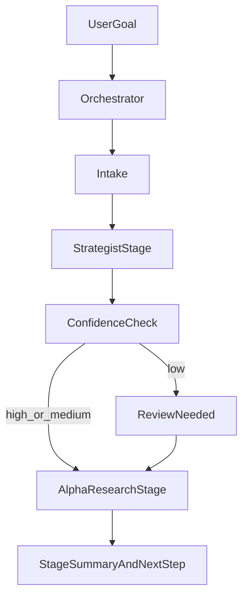

# Cursor Agent 工作流指南

> **Last updated**: 2026-03-24 (clarify foreground-autonomous vs manifest-based resume；補齊 resume UX 與 specialist handoff 邊界)

> 日常開發時的 prompt 參考。7 個 Agent、什麼時候用誰、怎麼下 prompt。
> 研究任務預設優先走 `@orchestrator` + slash commands；需要直接找專家時，再手動指定其他 agent。

---

## 你的角色

在 Research Orchestration MVP 中，你的角色從「人工 dispatcher」改成 **Supervisor（批准式監督者）**。

你的預設工作是：
- 給目標
- 只在低信心 / blocker / 高風險決策時 review
- 在需要時做批准 / 拒絕 / 暫停 / 續跑決策

你**不需要**再為每一步手動挑 agent、補同樣的上下文、追 heartbeat 或整理 handoff 結果。
這些動作由 `@orchestrator` 負責；只有在你想直接找某個專家 agent 深聊時，才手動切換。

這裡的「自動」現在有明確邊界：
- **會自動**：在同一個 active chat invocation 內一路跑多個 stage
- **不會自動**：在你不發新訊息時有背景 worker 繼續跑

### 三句話版本

1. `/start-research` = 在**當前 chat** 內盡量自動一路跑到 blocker / review / final packet。
2. chat 結束後，任務只會**保存在 `tasks/active/*.yaml`**，不會自己在背景繼續跑。
3. 想讓它繼續做事，請用 `/resume-task`，或直接開新 chat 說「繼續 task_id=...」。

---

## 速查：我想做什麼 → 叫誰？

**策略開發 & 審查**

| 我想... | Agent | Prompt 範例 |
|---------|-------|-------------|
| 只講目標，讓系統自動分流研究流程 | `@orchestrator` | `幫我研究 forced deleveraging reversal 是否值得做成 satellite strategy` |
| 查某個研究任務現在卡在哪裡 | `@orchestrator` | `幫我看 task_id=research_20260310_forced_deleveraging_reversal 的狀態` |
| 先診斷策略到底錯在 alpha、entry、exit 還是 sizing | `@portfolio-strategist` | `診斷目前 LSR contrarian 的核心痛點，幫我定義本輪只做哪一個 experiment family` |
| 分析 Baseline 弱點 / 找互補策略方向 | `@portfolio-strategist` | `分析目前 A (Baseline) 在哪些 regime 最弱，給我 3 個互補策略方向` |
| 判斷新方向該做 standalone 還是 filter | `@portfolio-strategist` | `這個策略適合當第二條腿還是 TSMOM 的 filter？` |
| 探索新策略想法 | `@alpha-researcher` | `幫我研究 Funding Rate 反向策略的可行性` |
| 看鏈上數據有沒有 alpha | `@alpha-researcher` | `分析 BTCUSDT Open Interest 變化與價格的 IC` |
| 整理研究成提案 | `@alpha-researcher` | `把上面的研究整理成 Strategy Proposal` |
| 實作策略程式碼 | `@quant-developer` | `根據 docs/research/xxx_proposal.md 實作策略` |
| 跑回測 | `@quant-developer` | `用 config/research_xxx.yaml 跑回測 + --quick 驗證` |
| 審查回測結果 | `@quant-researcher` | `審查 reports/research/xxx/ 的回測結果` |
| 上線前風控審查 | `@risk-manager` | `對 xxx 策略做 pre-launch audit` |
| 每週風控檢查 | `@risk-manager` | `跑這週的風控快速檢查` |
| 每週交易復盤 | `@risk-manager` | `跑本週的交易復盤` |

**部署 & 維運**

| 我想... | Agent | Prompt 範例 |
|---------|-------|-------------|
| 部署最新改動到線上 | `@devops` | `幫我部署最新改動到 Oracle Cloud` |
| 部署到 Oracle Cloud | `@devops` | `部署 xxx 策略到生產環境` |
| 排查線上問題 | `@devops` | `Runner 好像掛了，幫我排查` |
| 加新幣 / 下載數據 | `@devops` | `幫 config 加入 AAVEUSDT 並下載數據` |
| 設定 cron / 自動化排程 | `@devops` | `在 Oracle Cloud 加一個每週一跑 trade_review 的 cron` |

**維護 & 改進**

| 我想... | Agent | Prompt 範例 |
|---------|-------|-------------|
| 改進腳本/工具 | `@quant-developer` | `幫 trade_review.py 加一個 --output json 選項` |
| 清理過時的配置引用 | `@quant-developer` | `掃描所有 .cursor/ 和 docs/ 裡的舊配置引用並更新` |
| 改善流程 / 加新 gate | `@quant-developer` | `在 config-freeze 流程加入舊引用掃描步驟` |
| 更新 agent / rule 定義 | `@quant-developer` | `更新 risk-manager.md 的週檢查步驟` |
| 修 bug / 重構程式碼 | `@quant-developer` | `重構 xxx 模組，把 print 改成 logger` |
| 跑測試 | 任何 Agent | `跑一下 pytest 確認沒壞東西` |

> **不確定找誰？** 研究任務先用 `@orchestrator` 或 `/start-research`。只有在你明確知道要直接對哪個專家下指令時，才手動指定 agent。簡單規則：研究前期 routing / heartbeat / approval → `@orchestrator`；要先判斷 **Baseline 缺口 / 互補策略方向** → `@portfolio-strategist`；動到**程式碼或 `.cursor/` 檔案** → `@quant-developer`；動到 **Oracle Cloud / cron / tmux** → `@devops`；需要**風險判斷** → `@risk-manager`。

---

## Slash Commands（快捷指令）

常用的 prompt 已做成 slash command，存放在 `.cursor/commands/`。
在 Chat 輸入框打 `/` 就會看到可用指令，選擇後會自動填入完整 prompt。

| Command | Agent | 用途 |
|---------|-------|------|
| `/start-research` | `@orchestrator` | 建立 manifest，並在同一 invocation 內預設一路跑到 blocker / review / final packet；只有 low confidence 才 review |
| `/diagnose-strategy` | `@portfolio-strategist` | 先做 baseline pain 診斷 + experiment family 鎖定 + 研究路由，避免東補西補 |
| `/task-status` | `@orchestrator` | 讀取 manifest，回報 `running` / `blocked` / `stalled` / `awaiting_approval` 狀態與 rollback 摘要 |
| `/approve-stage` | `@orchestrator` | 批准或拒絕當前 gate，並讓流程往下一個 stage 前進 |
| `/resume-task` | `@orchestrator` | 讓 `paused` / `blocked` / `stalled` 的研究任務續跑 |
| `/continue-cycle` | `@orchestrator` | 讀取 running task 的 manifest + proposal，自動產出下一個 research cycle 的完整 prompt（免手動組裝） |
| `/deploy` | `@devops` | 部署最新改動到 Oracle Cloud（git push → pull → 重啟） |
| `/healthcheck` | `@devops` | 完整健康檢查（runner 狀態、持倉、系統資源） |
| `/backtest` | `@quant-developer` | 跑回測 + `--quick` 驗證（需填入 config 路徑） |
| `/config-freeze` | `@quant-developer` | 凍結研究配置為生產配置（Risk Manager APPROVED 後） |
| `/trade-review` | `@risk-manager` | 每週交易復盤（勝率/PnL 偏離/信號一致性/市場環境） |
| `/risk-review` | `@risk-manager` | 每週風控快速檢查（alpha decay + 一致性 + 倉位） |
| `/risk-action` | `@quant-developer` | 根據 risk-review WARNING 產出改善方案並跑對比回測 |
| `/research-audit` | `@quant-researcher` | 審查回測結果（需填入報告路徑） |
| `/eod` | 任何 Agent | End-of-Day 文件同步檢查 |

> **帶有 `<填入...>` 的指令**：選擇 command 後，把 placeholder 替換成實際路徑再送出。

### 新增自訂 Command

如果有新的常用流程想做成 command：

1. 在 `.cursor/commands/` 建立 `<command-name>.md`
2. 檔案內容就是完整 prompt（包含 `@agent` tag）
3. 重啟 Cursor 或重新載入後即可使用 `/<command-name>`

---

## 預設研究編排（MVP）

適合：你只想給一個研究目標，剩下的 intake / stage routing / progress tracking / final packet 整理由系統處理。

### 預設入口

- 新任務：`/start-research`
- 查狀態：`/task-status`
- 批准 gate：`/approve-stage`
- 續跑任務：`/resume-task`

### Task Manifest

每個研究任務都會有一個 manifest，儲存在 `tasks/active/`，格式與欄位定義見 `docs/ORCHESTRATION_MVP.md` 與 `tasks/_templates/research_task_manifest.yaml`。
它是 **system of record**，負責保存：
- state / heartbeat
- strategy / research decision
- touched files / artifacts
- rollback target / rollback steps

但它**不是**你平常要手動推流程的主介面。
它也**不是** background daemon 的替代品；active chat 內由 orchestrator 前景執行，chat 結束後才回到 manifest-based resume。

### `/resume-task` 預設應回什麼

為了讓跨 chat 續跑更穩定，`/resume-task` 的回覆至少應固定包含：
- `Task ID`
- `Current stage`
- `Status`
- `Blocker / review reason`（若無則明寫 `none`）
- `What changed`
- `What is running`
- `Next recommended action`
- `Recommended agent`
- `Primary files / artifacts`

### 狀態語意

| 狀態 | 意義 | 你要做什麼 |
|------|------|-----------|
| `running` | 任務正常前進中或可續跑 | 不需要介入，除非你要中止或改 scope；若 chat 已結束，代表它是可續跑狀態，不代表有背景程序 |
| `awaiting_approval` | 到了需要你批准的 gate | 用 `/approve-stage` 決定是否前進 |
| `blocked` | 缺資料、需求歧義、或有外部依賴卡住 | 補資訊或決定停掉 / 改 scope |
| `stalled` | 太久沒有 heartbeat，疑似中斷 | 用 `/task-status` 確認，再用 `/resume-task` 續跑 |
| `paused` | 你主動暫停 | 需要時再 `/resume-task` |
| `completed` | 當前 MVP 範圍已完成 | 看 summary，決定是否 handoff 或結案 |

### 高風險 gate（保留人工批准能力）

- `research_direction_approval`（僅 low confidence 才觸發）
- `config_freeze`
- `prod_deploy`
- `risk_incident_action`

### Research MVP Flow



---

## 四種工作模式

### Mode O: Research Orchestration MVP

適合：你想用單一入口管理研究流程，而不是自己手動 dispatch。

> **Execution model**：foreground-autonomous。只要沒有 blocker / review gate，`/start-research` 應在同一個 invocation 內直接跑完整條研究前段流程。

```
Step 0: /start-research → @orchestrator
        「給一個研究目標」
        → 產出: task manifest，並立即開始 intake

Step 1: @orchestrator
        自動執行 intake + strategist stage（必要時對齊 `@portfolio-strategist` contract）
        → 若高/中信心：同一 invocation 內直接續跑
        → 若低信心：才停在 review

Step 2: @orchestrator
        自動執行 alpha-research stage（必要時對齊 `@alpha-researcher` contract）
        → 產出: hypothesis / data needs / EDA findings / handoff recommendation
        → 若 verdict 已清楚：同一 invocation 內直接寫 final packet

Step 3: /task-status 或最終 summary
        你通常只看 blocker / review / final packet 邊界回覆
        → 決定 handoff / stop / archive / 擴大研究
```

> 若 `stop_or_handoff` 的結論是 `handoff_to_quant_developer` / `need_direction_change` / `stop_and_archive`，代表 **Research MVP 已完成**。接下來要不要繼續動手寫程式、重跑驗證、或結案，通常是你依 final packet 手動切到 specialist agent。

### Mode A: 完整流程（新策略從 0 到上線）

適合：全新策略開發，從研究到部署。

```
Step 0: @portfolio-strategist
        「分析 A (Baseline) 的弱點，定義這次研究要補的缺口」
        → 產出: Baseline Weakness Report / Complement Thesis Brief

Step 1: @alpha-researcher
        「我想研究 [主題]，幫我建 Notebook 做 EDA」
        → 產出: notebooks/research/YYYYMMDD_xxx_exploration.ipynb

Step 2: @alpha-researcher
        「IC 看起來不錯，整理成 Strategy Proposal」
        → 產出: docs/research/YYYYMMDD_xxx_proposal.md

Step 3: @quant-developer
        「根據 docs/research/xxx_proposal.md 實作策略，
         建 config/research_xxx.yaml，跑回測 + --quick 驗證」
        → 產出: src/qtrade/strategy/xxx_strategy.py
                config/research_xxx.yaml
                reports/research/xxx/

Step 4: @quant-researcher
        「審查 reports/research/xxx/ 的回測結果，跑完整驗證 pipeline」
        → 產出: GO_NEXT / NEED_MORE_WORK / FAIL
        （Researcher 獨立重跑 WFA/CPCV/DSR/Cost Stress/Delay Stress）

Step 5: @risk-manager  (只有 GO_NEXT 才到這步)
        「對 xxx 策略做 pre-launch audit，
         config: config/research_xxx.yaml」
        → 產出: APPROVED / CONDITIONAL / REJECTED

Step 6: @quant-developer  (只有 APPROVED 才到這步)
        「凍結 config/research_xxx.yaml → config/prod_live_xxx.yaml」
        → 產出: config/prod_live_xxx.yaml（凍結的生產配置）

Step 7: @devops
        「部署 xxx 策略，配置: config/prod_live_xxx.yaml」
        → 產出: 線上運行
```

> 建議把 Mode A 當成「**新策略標準生命週期**」：研究先走 orchestrator / strategist / alpha research，明確 GO 之後才切到 `@quant-developer`、`@quant-researcher`、`@risk-manager`、`@devops`。

### Mode B: 快速迭代（改進現有策略）

適合：調參數、加 filter、修 bug。若是互補策略方向不明，先找 Portfolio Strategist。

```
Step 0: @portfolio-strategist (optional)
        「先判斷這次改動是在補哪個 Baseline 缺口」

Step 1: @quant-developer
        「在 tsmom_ema 策略加一個 volatility filter，
         用 config/research_tsmom_vol.yaml 跑回測」

Step 2: @quant-researcher
        「審查回測結果，對比 baseline」

Step 3: @risk-manager  (if GO_NEXT)
        「做 pre-launch audit」

Step 4: @quant-developer  (if APPROVED)
        「凍結研究配置為生產配置 config/prod_live_*.yaml」

Step 5: @devops
        「部署已凍結的 config/prod_live_*.yaml 並重啟 runner」

Step 6: @devops
        「幫我部署最新改動到 Oracle Cloud」
        → Agent 自動：git push → SSH pull → 重啟 runner
```

### Mode B.5: Strategy R&D OS（避免東補西補）

適合：你已經知道策略有問題，但**不知道是 alpha source、entry、exit、sizing 還是 portfolio role 出問題**。

核心原則：

1. **每一輪 research cycle 只做一個 primary experiment family**
2. **先分清楚是在驗證 alpha 存不存在，還是在優化 trade expression**
3. **Loop A 沒過，不進 Loop B**

#### 五種 Experiment Families

| Family | 典型問題 | 例子 |
|--------|---------|------|
| `signal_mechanism` | alpha source 本身有沒有？ | LSR 新 normalization、近資料加權、state label |
| `entry_timing` | 同一個 edge 要怎麼進得更準？ | band touch、HTF resonance、threshold persistence |
| `exit_design` | 已確認的 edge 怎麼兌現？ | NW center TP、ATR SL、time stop |
| `position_sizing` | 好 setup 要不要加碼、弱 setup 要不要縮？ | conviction scaling、regime size multiplier |
| `portfolio_role` | 這東西該 standalone、overlay 還是 replace？ | long-only variant、satellite vs overlay |

#### 兩個研究迴圈

| Loop | 要回答的問題 | 典型證據 |
|------|-------------|---------|
| `Loop A: Alpha Existence` | 這個原始機制真的有 alpha 嗎？ | causal IC、conditional IC、年度穩定性、頻率、pure vs confounded |
| `Loop B: Trade Expression` | 已存在的 edge 應該怎麼表達？ | expectancy、MDD、hold time、cost drag、trade count |

**硬規則**：
- 如果 raw signal 還沒證明存在，不要先討論 TP/SL。
- 如果同一輪同時改 signal + entry + exit，結論通常不可信。
- 如果 trade count 從 120/yr 掉到 3/yr，就算 conditional return 很漂亮也不能直接當策略成立。

#### 建議操作順序

1. `/diagnose-strategy`
   - 先讓 `@portfolio-strategist` 產出 `Strategy Diagnosis Card`
   - 明確寫出 baseline pain、痛點 regime、primary family、pass / kill rule
2. `@alpha-researcher`
   - 只跑**一個 family** 的 EDA / ablation
   - Notebook 中先寫 `Research Cycle Declaration`
3. `@quant-developer`
   - 只實作已明確通過研究 gate 的變體
4. `@quant-researcher`
   - 拒絕混合多個 family 的模糊勝利

#### 你真正要問 AI 的，不是「怎麼救策略」

而是這一輪固定問：

- `Baseline pain`: 現在哪裡受傷最重？
- `Experiment family`: 這輪只研究哪一類問題？
- `Loop type`: Alpha Existence 還是 Trade Expression？
- `What stays fixed`: 哪些東西這輪不准動？
- `Pass rule`: 用什麼指標算過關？
- `Kill rule`: 什麼結果代表方向錯了？

### Mode C: 日常維運

適合：每天/每週的例行檢查。

```
每日:
  @devops  「跑健康檢查和每日報表」

每週:
  Step 1: /trade-review → @risk-manager 跑交易復盤（勝率/PnL 偏離/信號一致性）
  Step 2: /risk-review → @risk-manager 產出風控報告（含 alpha decay + 一致性檢查）
  Step 3: 如果有 WARNING → /risk-action → @quant-developer 跑改善方案 + 對比回測
  Step 4: 把對比結果交給 @risk-manager 做最終判決
  Step 5: 如果 APPROVED → /config-freeze → @quant-developer 凍結新 config
  Step 6: @devops 部署凍結後的 config

每月:
  @risk-manager  「跑月度深度風控審查（Monte Carlo + 相關性 + Kelly 校準）」

有問題時:
  @devops  「Runner 異常 / 倉位不對 / 連線問題，排查」
```

---

## 部署同步（Local → Oracle Cloud）

**最簡單的方式**：直接叫 DevOps agent 幫你做：

```
@devops 幫我部署最新改動到 Oracle Cloud
```

Agent 會自動執行 git push → SSH pull → 判斷是否重啟 runner，並在 commit 前和重啟前跟你確認。

以下是手動流程（供參考或 agent 不可用時使用）。

程式碼透過 GitHub 同步：本機 push → Oracle Cloud pull。

```
┌──────────┐    git push    ┌──────────┐    git pull    ┌──────────────┐
│  Local   │ ────────────→  │  GitHub  │ ←──────────── │ Oracle Cloud │
│ (Cursor) │                │   Repo   │                │  (trading)   │
└──────────┘                └──────────┘                └──────────────┘
```

### 完整流程

```bash
# ── 1. 本機：commit + push ──
git add -A
git commit -m "feat: 改動描述"
git push

# ── 2. SSH 到 Oracle Cloud ──
ssh -i ~/.ssh/oracle-trading-bot.key ubuntu@140.83.57.255

# ── 3. Pull 最新 code ──
cd ~/quant-binance-spot
git pull

# ── 4. 判斷是否需要重啟 Runner ──
# 如果改了 config / 策略邏輯 / 依賴 → 需要重啟
# 如果只改了 docs / tests / scripts → 不需要（下次 runner 自動重啟時會 git pull）
```

### 需要重啟 Runner 時

```bash
# 重啟主策略
tmux attach -t meta_blend_live   # 進入 tmux
# Ctrl+C 停止 runner
# Ctrl+B, d 離開 tmux

# runner 會自動重啟（tmux 裡的 while true 循環）
# 等 10 秒後確認
sleep 10 && tmux capture-pane -t meta_blend_live -p | tail -20
```

### 什麼改動需要重啟？

| 改動類型 | 需要重啟？ | 原因 |
|---------|-----------|------|
| `config/prod_live_*.yaml` | **是** | Runner 啟動時讀取 config |
| `src/qtrade/strategy/` | **是** | 策略邏輯變更需重新載入 |
| `src/qtrade/live/` | **是** | Runner 核心邏輯 |
| `src/qtrade/data/` | **是** | 數據處理邏輯 |
| `docs/` / `tests/` | 否 | 不影響運行中的 runner |
| `scripts/` | 否 | Runner 不引用其他 script |
| `.cursor/` | 否 | 只影響本機開發 |

### 快速一鍵部署（Copy-Paste）

```bash
# 本機一行搞定
git add -A && git commit -m "fix: 改動描述" && git push

# Oracle Cloud 一行搞定（不重啟 runner，等自動重啟）
ssh -i ~/.ssh/oracle-trading-bot.key ubuntu@140.83.57.255 \
  "cd ~/quant-binance-spot && git pull"

# Oracle Cloud 一行搞定（強制重啟 runner）
ssh -i ~/.ssh/oracle-trading-bot.key ubuntu@140.83.57.255 \
  "cd ~/quant-binance-spot && git pull && tmux send-keys -t meta_blend_live C-c"
```

> **注意**：tmux 裡的 `while true; do git pull && run_websocket.py; done` 循環會在 runner 停止後自動 pull 最新 code 並重啟。所以 `Ctrl+C` 停止 runner 就等於「重啟」。

---

## 讀取 Agent 輸出 — Next Steps 機制

每個 Agent 完成任務後，都會在輸出最後附上一個 **「Next Steps (pick one)」** 表格。
在 **manual 模式** 下，這讓你不需要記住完整流程；在 **orchestrated 模式** 下，優先使用 `/approve-stage`、`/resume-task`、`/task-status`，只有脫離 MVP 流程時才手動複製 prompt。

### 格式

```markdown
---
## Next Steps (pick one)

| Option | Agent | Prompt | When to pick |
|--------|-------|--------|-------------|
| A | `@next-agent` | "就緒可用的 prompt 文字..." | 什麼情況選這個 |
| B | `@other-agent` | "另一個可用的 prompt..." | 什麼情況選這個 |
```

### 使用方式

1. **看完 Agent 的報告結果**
2. **捲到最後的 Next Steps 表格**
3. **選一個 Option**，複製它的 Prompt 欄位
4. **新開 Chat，貼上 Prompt，必要時微調**（如填入路徑、加上你的判斷）
5. **送出**

### 關鍵原則

- 建議是 **advisory（建議性的）**，你永遠可以選不在表上的動作
- 如果你不確定選哪個，通常 **Option A 是預設推薦**
- 每個 Prompt 裡會包含足夠的上下文（路徑、數字、判決），下一個 Agent 不需要回頭翻
- 如果表格沒有出現，提醒 Agent：「請附上 Next Steps 選項」

### 各 Agent 的典型 Next Steps

| Agent 完成後 | 常見選項 |
|-------------|---------|
| Portfolio Strategist | A: 交給 Alpha Researcher 做 EDA · B: 交給 Developer 直接做 ablation · C: 關閉方向 |
| Alpha Researcher | A: 交給 Developer 實作 · B: 轉換研究方向 · C: 歸檔停止 |
| Quant Developer | A: 提交 Researcher 審查 · B: 自我迭代改進 · C: 退回 Researcher |
| Quant Researcher | GO→ Risk Manager · NMW→ Developer · FAIL→ Researcher 或歸檔 |
| Risk Manager | APPROVED→ Developer (config freeze) → DevOps · CONDITIONAL→ Developer · REJECTED→ Developer |
| DevOps | A: 跑健康檢查 · B: 排定風控觀察 |

---

## 研究交接封包（Handoff Packet）

不論是 orchestrated 模式還是 manual specialist handoff，研究任務結束時都應盡量收斂成同一種封包欄位，讓下一個 agent 不必回頭翻整串對話：

- `Current status`
- `Next recommended action`
- `Recommended agent`
- `Primary files / artifacts`
- `Key decision`
- `Open risks / blockers`

如果是 `@orchestrator` 的 `stop_or_handoff` 邊界回覆，至少前四項要穩定出現。

---

## Prompt 技巧

### 1. 指定角色就夠了

不需要重複解釋系統架構 — Agent 會自動讀取 `.cursor/rules/` 和自己的角色定義。

```
# 好 — 簡潔
@quant-developer 根據 proposal 實作 funding_reversal 策略

# 不需要 — 過度描述
@quant-developer 我們用的是 vectorbt 回測框架，策略要用 @register_strategy，
信號範圍 [-1,1]，要避免 look-ahead bias... 幫我實作策略
```

### 2. 提供具體路徑

Agent 讀檔案比猜測快。給路徑 > 給描述。

```
# 好
@quant-researcher 審查 reports/research/funding_reversal/20260224_120000/ 的結果

# 差
@quant-researcher 審查一下我剛跑的那個策略回測
```

### 3. 一次一個任務

不要在一個 prompt 裡讓同一個 Agent 做多件不相關的事。

```
# 好 — 分兩個 prompt
@quant-developer 實作 funding_reversal 策略
（等完成後）
@quant-developer 跑回測

# 差 — 太多事混在一起
@quant-developer 實作策略、跑回測、優化參數、然後幫我部署
```

### 4. 退回時附理由

當 Researcher 或 Risk Manager 退回時，把理由帶給下一個 Agent。

```
@quant-developer
Researcher 判定 NEED_MORE_WORK，原因：
1. WFA OOS Sharpe < 0.3 (只有 0.18)
2. 2024 年度報酬為負
請調整策略參數或加 regime filter 改善
```

### 5. 用固定研究模板發問

當你在討論策略改進，不要直接問：

```text
這個策略是不是要改 TP / SL / HTF / 權重？
```

改成：

```markdown
Baseline pain:
Experiment family:
Loop type:
Hypothesis:
What stays fixed:
Pass rule:
Kill rule:
Deliverable:
Relevant files:
```

例如：

```markdown
Baseline pain: LSR contrarian 有正 expectancy，但 standalone MDD 太高。
Experiment family: exit_design
Loop type: Trade Expression
Hypothesis: NW center TP 可以在不明顯傷害 expectancy 的前提下降低 MDD。
What stays fixed: BTC-only、1h、同一個 LSR signal、同一個 cost model、同一個 entry threshold。
Pass rule: MDD 改善 > 15%，expectancy 下降 < 10%。
Kill rule: net expectancy <= 0，或 trades/year < 30。
Deliverable: 3-row exit experiment matrix + 建議下一步。
Relevant files: src/qtrade/strategy/lsr_contrarian_strategy.py, src/qtrade/strategy/nwkl_strategy.py
```

### 6. 不要先新增 Agent

大多數情況下，問題不在「少一個 agent」，而在 prompt 與 handoff 沒有鎖定實驗範圍。

預設分工已足夠：
- `@portfolio-strategist`：先診斷痛點、鎖定 family
- `@alpha-researcher`：做單一 family 的 EDA 與 falsification
- `@quant-developer`：只實作已定義清楚的變體
- `@quant-researcher`：拒絕過擬合與混合結論

優先新增：
- skill
- slash command
- diagnosis / experiment matrix 模板

只有在你能說出「哪個決策責任目前沒有任何 agent 擁有」時，才值得新增 agent。

### 7. 用 Plan Mode 做大型任務

按 `Shift+Tab` 進入 Plan Mode，讓 Agent 先分析 → 提問 → 擬定計畫 → 你確認後再執行。
適合用在：大重構、新模組設計、多檔案改動。

---

## 文件產出路徑總覽

| Phase | 產出 | 路徑 |
|-------|------|------|
| 研究探索 | Notebook | `notebooks/research/YYYYMMDD_*.ipynb` |
| 策略提案 | Proposal | `docs/research/YYYYMMDD_*_proposal.md` |
| 研究配置 | YAML | `config/research_*.yaml` |
| 策略程式碼 | Python | `src/qtrade/strategy/*_strategy.py` |
| 回測報告 | Report | `reports/research/<topic>/<timestamp>/` |
| 風控報告 | Audit | `reports/risk_audit/<timestamp>/` |
| 策略模板 | YAML | `config/futures_*.yaml` (可複用的策略定義) |
| 生產配置 | YAML | `config/prod_live_*.yaml` (由 Developer 凍結) |
| 實盤日誌 | Log | `logs/websocket.log` |

---

## 檢查清單：上線前必做

- [ ] **Validation Matrix 全部 PASS**（見 Playbook Section 7，V1-V12）
- [ ] **Overlay ablation 完成**（見 Playbook Stage D.5），報告中明確標註 overlay ON/OFF
- [ ] **`validate_live_consistency.py` 通過**（含 overlay 一致性檢查）
- [ ] Quant Researcher 判定 `GO_NEXT`（含一致性 gate）
- [ ] Risk Manager 判定 `APPROVED`
- [ ] Quant Developer 已凍結生產配置（`config/prod_live_xxx.yaml`）且不與研究配置混用
- [ ] 數據已下載（K 線 + Funding Rate + 策略所需額外數據如 OI）
- [ ] `prod_launch_guard.py` 通過
- [ ] Paper trading 至少跑 1 週（可選但建議）
- [ ] Telegram 通知已配置

---

## Agent 定義檔位置

| Agent | 檔案 |
|-------|------|
| Orchestrator | `.cursor/agents/orchestrator.md` |
| Portfolio Strategist | `.cursor/agents/portfolio-strategist.md` |
| Alpha Researcher | `.cursor/agents/alpha-researcher.md` |
| Quant Developer | `.cursor/agents/quant-developer.md` |
| Quant Researcher | `.cursor/agents/quant-researcher.md` |
| Risk Manager | `.cursor/agents/risk-manager.md` |
| DevOps | `.cursor/agents/devops.md` |

## Rules 定義檔位置

| Rule | 檔案 | 適用範圍 |
|------|------|----------|
| Project Overview | `.cursor/rules/project-overview.mdc` | 全局（alwaysApply） |
| Anti-Bias | `.cursor/rules/anti-bias.mdc` | 全局（alwaysApply） |
| Python Standards | `.cursor/rules/python-standards.mdc` | 所有 `*.py` |
| Strategy Dev | `.cursor/rules/strategy-dev.mdc` | `src/qtrade/strategy/**` |
| Backtest | `.cursor/rules/backtest.mdc` | backtest 相關檔案 |
| Live Trading | `.cursor/rules/live-trading.mdc` | live 相關檔案 |
| Research Methodology | `.cursor/rules/research-methodology.mdc` | research 相關檔案 |
