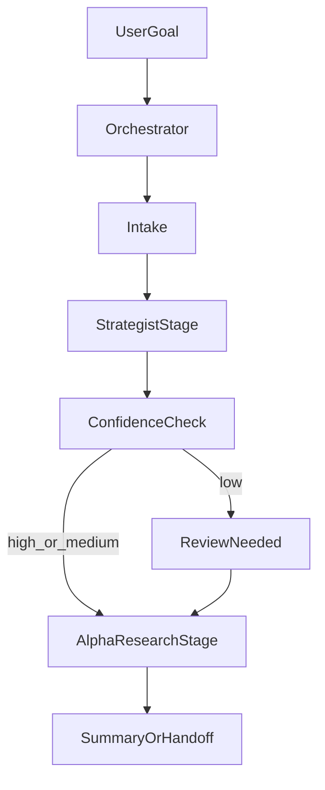

# Research Orchestration MVP

> **Last updated**: 2026-03-11

> Cursor-first 的研究編排規格。目標是把使用者從「手動選 agent + 補 prompt + 追進度」轉成「只給目標，系統自動串 stage；只有低信心或高風險時才 review」。

---

## 1. Scope

### Included

- `@orchestrator` 單一研究入口
- active chat 內的 **foreground-autonomous** 多 stage 執行
- `tasks/active/*.yaml` task manifest
- 結構化 stage outputs
- heartbeat / liveness state
- 低信心 review gate
- rollback / audit metadata

### Deferred

- Discord / Telegram 控制面
- 工程實作與維運的完整 orchestration
- **background queue / 多任務排程**
- 自動 deploy / 自動 freeze

---

## 1.1 Execution Modes

### `foreground_autonomous`（本輪要做到的）

- 一次 `/start-research` invocation 內，orchestrator 應在同一個 chat session 連續跑
  `intake -> strategist -> alpha_research -> stop_or_handoff`
- 每完成一個 stage 都先更新 manifest，再決定是否繼續
- 只有以下情況才提前停下來回覆使用者：
  - `confidence_level = low`
  - 有明確 blocker
  - 需要 approval
  - 已產出 final packet

### `background_queue`（仍 deferred）

- 背景 daemon / worker
- chat 結束後自動續跑
- 多任務 scheduler
- 無使用者新訊息時的 async progress push

因此這個 MVP 的正確語意是：
- **在 chat 活著時要盡量一口氣跑完**
- **chat 結束後靠 manifest 續跑，而不是假裝有背景 worker**

---

## 2. Goal

研究任務的預設流程應變成：

1. 使用者只描述目標
2. `@orchestrator` 建 task manifest
3. 系統在**同一個 active chat invocation** 內自動串 intake、strategist、alpha research、summary
4. 只有低信心 / blocker / 高風險時才中途 ask
5. 每個 task 都留下可追溯、可回退的 manifest
6. 任務若過夜仍可用 `/task-status` 確認是不是還活著

---

## 3. Target Flow

> 預設執行模式是 **foreground-autonomous**：不是只建立 manifest，而是要在同一次互動裡持續往下跑，直到碰到 stopper 或 final packet。

---

## 4. Task Manifest Schema

每個 research task 使用一份 YAML manifest。最低必備欄位如下：

| Field | Required | Purpose |
|------|----------|---------|
| `task_id` | yes | 穩定的任務識別碼 |
| `goal` | yes | 使用者的一句話目標 |
| `mode` | yes | 目前固定為 `research_orchestration_mvp` |
| `current_stage` | yes | intake / strategist / low_confidence_review / alpha_research / stop_or_handoff |
| `status` | yes | running / awaiting_approval / blocked / stalled / paused / completed / cancelled |
| `owner_agent` | yes | 目前負責該 stage 的 agent |
| `confidence_level` | yes | high / medium / low |
| `review_required` | yes | 是否要中途請使用者 review |
| `review_reason` | yes | 為什麼需要 review |
| `stage_started_at` | yes | 目前 stage 開始時間 |
| `last_heartbeat_at` | yes | 最後一次確認仍在工作的時間 |
| `code_audit` | yes | 這個 task 影響了哪些檔案、commit、測試 |
| `rollback` | yes | 若改壞，怎麼回退 |
| `required_artifacts` | yes | 此階段結束前必須具備的交付物 |
| `artifacts` | yes | 已產出的路徑 |
| `blockers` | yes | 當前 blocker 清單 |
| `next_recommended_action` | yes | 下一步建議 |
| `final_packet` | yes | 對使用者的最終整合輸出 |

官方模板：`tasks/_templates/research_task_manifest.yaml`

---

## 5. Status Semantics

| Status | Meaning | When to use |
|--------|---------|-------------|
| `running` | 任務正常推進 | 正在做 intake / strategist / research |
| `awaiting_approval` | 等使用者決策 | 僅在 low confidence 或高風險 gate 時出現 |
| `blocked` | 有明確 blocker | 缺資料、目標不清、依賴缺失 |
| `stalled` | 長時間無 heartbeat | 不是理論 blocker，而是疑似執行中斷 |
| `paused` | 人工暫停 | 等之後恢復 |
| `completed` | MVP 範圍已完成 | handoff、stop、或 archive 建議已產出 |
| `cancelled` | 任務被終止 | 使用者主動取消 |

`blocked` 與 `stalled` 不可混用：
- `blocked` = 知道為什麼卡住
- `stalled` = 不知道為什麼沒有動靜

---

## 6. Approval Gates

以下 gate 保留人工批准能力：

| Gate | Trigger |
|------|---------|
| `research_direction_approval` | 僅在 strategist 結果 `low_confidence` 時才觸發 |
| `config_freeze` | 研究完成且經風控批准，準備凍結生產配置前 |
| `prod_deploy` | 準備推到 Oracle Cloud 前 |
| `risk_incident_action` | 風控異常需要 reduce / flatten / rollback 時 |

Research V2 的原則是：`research_direction_approval` 改成 exception-based review，不再是固定 gate；但 manifest schema 仍保留完整 approval 結構供 freeze/deploy/risk 使用。

---

## 7. Stage Contracts

### 7.1 intake

**Entry criteria**
- 使用者提供至少一句話目標

**Exit criteria**
- goal 已正規化
- manifest 已建立
- 若無 blocker，立即進 strategist stage

### 7.2 strategist

**Entry criteria**
- intake 完成
- goal 與 baseline context 足夠可讀

**Required output**
- `gap`
- `archetype`
- `integration_mode`
- `success_criteria`
- `kill_criteria`
- `next_recommended_action`

**Exit criteria**
- 已足夠提交 `research_direction_approval`
  或
- 已明確標示 blocker / stop reason
- 若 `confidence_level != low` 且無 blocker，**同一 invocation 內立即進 alpha_research**

### 7.3 low_confidence_review

**Entry criteria**
- strategist 結果信心不足，或後續投入風險過高

**Exit criteria**
- 使用者 `approve` / `reject` / `narrow_scope` / `broaden_scope` / `cancel`
- 若使用者批准，下一個 invocation 應從被卡住的 stage 直接續跑，而不是重做 intake

### 7.4 alpha_research

**Entry criteria**
- research direction 已批准

**Required output**
- `hypothesis`
- `data_requirements`
- `coverage_gate`
- `eda_findings`
- `handoff_recommendation`
- `next_recommended_action`

**Exit criteria**
- 產出以下其中之一：
  - `handoff_to_quant_developer`
  - `need_direction_change`
  - `stop_and_archive`
- 若 verdict 已明確，**同一 invocation 內立即寫入 stop_or_handoff**

### 7.5 stop_or_handoff

**Entry criteria**
- alpha research stage 已有明確 verdict

**Exit criteria**
- 任務標為 `completed`
- summary 與推薦下一步已寫回 manifest

**Required final packet shape**
- `current_status`
- `key_decision`
- `recommendation`
- `recommended_agent`
- `primary_files`
- `open_risks`
- `next_recommended_action`

`stop_or_handoff` 的目標不是只更新 manifest，而是產出一個可直接交棒或結案的 handoff packet。

### 7.6 Foreground Execution Loop

`/start-research` 與 orchestrator 的預設執行 loop 應為：

1. 建立 manifest
2. 執行 intake
3. 若 clear，立刻執行 strategist
4. 若仍 clear，立刻執行 alpha research
5. 若 verdict 明確，立刻寫入 `stop_or_handoff`
6. 只有在 `blocked` / `awaiting_approval` / `completed` 時才對使用者輸出邊界回覆

manifest 是 ledger，不是 execution 的替代品。

---

## 8. Heartbeat And Timeout Policy

### Heartbeat

- 預設 interval：60 分鐘
- 任何超過 60 分鐘的 stage，都要刷新 `last_heartbeat_at`
- heartbeat 也可附帶簡短 progress note
- `running` 表示 task 仍有效且可續跑，不保證有背景程序正在執行

### Timeout

- 預設 timeout：180 分鐘
- 超過 timeout 且無新 heartbeat → 狀態轉為 `stalled`

### Resume rules

- `blocked`：必須先補 blocker 或調 scope
- `stalled`：先確認是否真的中斷，再 `/resume-task`
- `paused`：可直接 `/resume-task`

---

## 9. Confidence Policy

### Auto-advance default

預設自動前進。只有 `confidence_level = low` 才把使用者拉進流程中。
這裡的「自動前進」指的是 **同一個 active chat invocation 內的連續 stage 執行**，
不是背景 queue。

### High confidence

- gap 明確
- archetype 明確
- integration mode 明確
- 資料足夠
- 下一步投入成本低

### Medium confidence

- 方向大致清楚
- 有一個可控不確定
- 可繼續，但 final packet 需標風險

### Low confidence

- 不知道該做 `filter / overlay / standalone / dormant`
- blocker 可能改變研究方向
- 繼續下去可能浪費明顯時間
- 結論將導致高成本投入

---

## 10. Human Override Actions

使用者可對任何 task 執行：

- `approve`
- `reject`
- `pause`
- `resume`
- `cancel`
- `reroute`
- `narrow_scope`
- `broaden_scope`

Override 後，`@orchestrator` 必須：
1. 更新 manifest
2. 說明狀態怎麼改
3. 告訴使用者下一步會是什麼

---

## 11. Rollback / Audit Metadata

Task manifest 是 system of record。至少要能回答：

- 這次 task 從哪個基準開始
- 改了哪些檔
- 產出了哪些文件 / 報告
- 有沒有跑測試
- 有沒有改 config
- 如果改壞，應該怎麼退

最低欄位：

- `code_audit.base_commit`
- `code_audit.head_commit`
- `code_audit.touched_files`
- `code_audit.generated_artifacts`
- `code_audit.tests_run`
- `rollback.type`
- `rollback.target`
- `rollback.steps`
- `rollback.verified`

---

## 12. Artifact Storage

| Artifact | Path |
|---------|------|
| Task manifest | `tasks/active/<timestamp>_<slug>.yaml` |
| Template | `tasks/_templates/research_task_manifest.yaml` |
| Pilot replay | `tasks/pilots/*.yaml` |
| Research notebook | `notebooks/research/YYYYMMDD_*.ipynb` |
| Strategy proposal | `docs/research/YYYYMMDD_*_proposal.md` |

命名原則：
- 使用 UTC timestamp + slug
- `task_id` 需穩定，不因 stage 變動而改名

---

## 13. Cursor Commands

| Command | Purpose |
|---------|---------|
| `/start-research` | 建 manifest，並在同一 invocation 內持續跑到 blocker / review / final packet 邊界；只有 low confidence 才回來 ask |
| `/task-status` | 回報 liveness / blocker / review / rollback 狀態 |
| `/approve-stage` | 對 gate 做 approve/reject/scope change |
| `/resume-task` | 讓 `paused` / `blocked` / `stalled` 的任務續跑 |

---

## 14. Pilot Replay Notes

Pilot replay 使用 4 個樣本測試四種核心狀態：

| Pilot | Tested state | What it taught us |
|------|--------------|-------------------|
| `macro_regime_awaiting_direction_approval` | `awaiting_approval` | strategist 結束後必須先停在方向批准，不應直接展開跨市場資料 fanout |
| `forced_deleveraging_reversal_blocked` | `blocked` | blocker 必須明寫成「缺什麼資料 / 目前怎麼補 / 不補會怎樣」，不能只讓 task 無聲停住 |
| `tick_ofi_handoff_ready` | `completed` | research 結束時一定要有單一 `handoff_recommendation`，避免使用者自己整理下一步 |
| `foreground_autonomous_happy_path` | `completed` | `/start-research` 的 happy path 應在單次 invocation 內跑完 intake → strategist → alpha research → final packet |

因此 V2 對 manifest 又補了 4 個操作性要求：

1. `review_required` 只在低信心時打開
2. `blockers` 要可承載具體原因與解除條件
3. `next_recommended_action` 必須只有一個預設推薦動作
4. `final_packet` 要讓使用者能直接做最終判斷，不需要自己整理
5. `/resume-task` 與 `/start-research` 的 completed 邊界回覆，都應穩定包含 `Recommended agent` 與 `Primary files / artifacts`

範例放在 `tasks/pilots/`。
